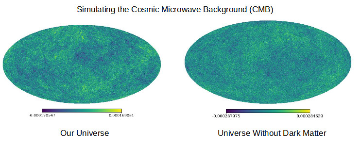
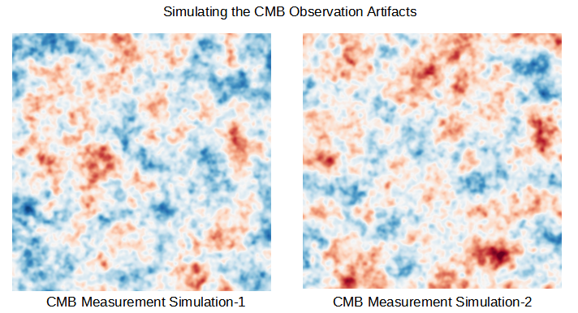

# Deep-Learning-for-Cosmology
Simulating the Cosmic Microwave Background (CMB) radiation in different cosmologies and classifying the CMB temperature maps with deep learning

# Machine Learning for Cosmology

ml-in-cosmology: https://github.com/georgestein/ml-in-cosmology , https://github.com/georgestein/ml-in-cosmology#datasets , https://github.com/georgestein/ml-in-cosmology#tools

Dvorkin_2022: Machine Learning and Cosmology, https://arxiv.org/abs/2203.08056

Cora Dvorkin, Harvard, https://dvorkin.physics.harvard.edu/

AI Institute for Artificial Intelligence and Fundamental Interactions (IAIFI), https://iaifi.org/

## Simulating the Cosmic Microwave Background (CMB)

CMB_Summer_School: https://cocalc.com/share/public_paths/b5e7ec1aaacde391032512694af4e4be53af04c4 , https://cocalc.com/share/public_paths/b5e7ec1aaacde391032512694af4e4be53af04c4/CMB_Analysis_Summer_School_PartOne.ipynb

https://camb.readthedocs.io/en/latest/

https://camb.readthedocs.io/en/latest/CAMBdemo.html

https://healpy.readthedocs.io/en/latest/tutorial.html

https://healpy.readthedocs.io/en/latest/

https://github.com/ixkael/Prob-tools/blob/master/notebooks/The%20CMB%20as%20a%20Gaussian%20Process.ipynb

## Inflation and CMB

https://www.amazon.com/Losing-Nobel-Prize-Cosmology-Ambition/dp/1324000910    

Cosmic Inflation Theory Faces Challenges: Pop Goes the Universe, https://www.scientificamerican.com/article/cosmic-inflation-theory-faces-challenges/

A COSMIC CONTROVERSY: https://www.scientificamerican.com/article/readers-respond-to-the-february-and-march-2017-issues/

## Computer Vision for CMB Analysis

Dark matter density extraction using Convolutional Neural Networks, https://web.archive.org/web/20210617215804id_/https://assets.researchsquare.com/files/rs-612281/v1_covered.pdf

Recovering Cosmic Microwave Background Polarization Signals with Machine Learning, 2023, https://iopscience.iop.org/article/10.3847/1538-4357/acbfb4/meta  

Convolutional Neural Networks on the HEALPix sphere: a pixel-based algorithm and its application to CMB data analysis https://arxiv.org/abs/1902.04083

(2023) Analysis of Cosmic Microwave Background with Deep Learning, https://openreview.net/forum?id=B15uoOyvz , 

https://iopscience.iop.org/article/10.3847/1538-4365/ac5f4a

Summary: We present the first attempt at using advanced deep learning methods to predict cosmological parameters and their corresponding errors directly from the distribution of photons in Cosmic Microwave Background.
Abstract: The observation of Cosmic Microwave Background (CMB) has been one of the cornerstones in establishing the current understanding of the Universe. This valuable source of information consists of primary and secondary effects. While the primary source of information in CMB (as a Gaussian random field) can be efficiently analyzed using established statistical methods, CMB is also host to secondary sources of information that are more complex to analyze and understand. Here, we report encouraging preliminary results as well as some difficulties in using deep learning for prediction of the cosmological parameters and uncertainty estimates from the primary CMB. This opens the way to application of deep models in analysis of the secondary CMB and joint analysis of CMB with other modalities such as the large-scale structure.

https://openreview.net/forum?id=B15uoOyvz

## Generative-AI for CMB

Inpainting via Generative Adversarial Networks for CMB data analysis, https://arxiv.org/abs/2004.04177   

https://arxiv.org/abs/1908.04682   

https://iopscience.iop.org/article/10.1088/1475-7516/2021/03/012/meta

## Hawking/Hetog Top-Down Cosmology

Cosmology from the Top Down: https://arxiv.org/ftp/astro-ph/papers/0305/0305562.pdf

Populating the Landscape: A Top-Down Approach: https://journals.aps.org/prd/abstract/10.1103/PhysRevD.73.123527

Mr. Hawking's Flexiverse: https://www.newscientist.com/article/mg19025481-300-exploring-stephen-hawkings-flexiverse/

A Smooth Exit from Eternal Inflation: https://link.springer.com/article/10.1007/JHEP04(2018)147

### Miscellaneous

(2001) Cosmic Microwave Background Observables and Their Cosmological Implications, https://iopscience.iop.org/article/10.1086/319449/meta

A Bayesian Framework for Cosmic String Searches in CMB Maps, https://arxiv.org/pdf/1706.04131.pdf

(had a conventional bayesian-deep-learning paper on CMB and parameter extraction. bayesian and other one was spherical-CNN)

Parameter estimation for the cosmic microwave background with Bayesian neural networks, 2020, https://journals.aps.org/prd/abstract/10.1103/PhysRevD.102.103509

(next steps: grow data sizes, train CNN, ViT, . . . ) 

Caltech Ay 21, Galaxies and Cosmology, 2020, https://sites.astro.caltech.edu/~ccs/Ay21/ (Chuck Steidel)

These may be helpful for alternative treatments of selected topics. Copies are on reserve in the Cahill library. :
Introduction to Cosmology (second edition, 2017)
by Barbara Ryden
ISBN 978-1107154834
(2017 Cambridge University Press)
This is a very nice book, at almost the perfect level for Ay21; it covers most of the cosmology topics we'll be looking at, but does not cover as much on galaxies, galaxy formation, and other more astrophysical concepts.
Observational Cosmology
by Stephen Serjeant
ISBN 978-0521157155
(2010, Cambridge University Press)
Rather light on theory and calculation, but comprehensive, well explained, and well-illustrated in full color.

Caltech Ay 21, Galaxies and Cosmology, 2023, https://sites.astro.caltech.edu/~george/ay21/ (George Djorgovski)

